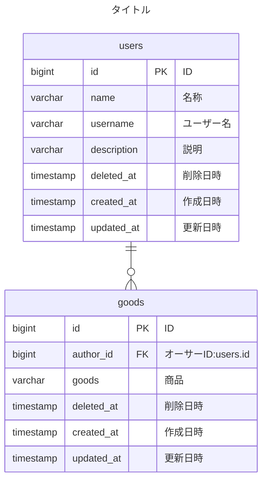

# sellfruits

## 環境構築手順

-   コンテナを立ち上げるため、以下を実行

```
docker compose up -d --build
```

-   env ファイルの作成をするため、以下を実行

```
cp src/.env.example src/.env
```

-   php にコンテナに入るため、以下を実行

```
docker compose exec php bash
```

-   composer パッケージをインストールするため、以下を実行

```
composer install
```

-   アプリケーションキーを作成するため、以下を実行

```
php artisan key:generate
```

-   マイグレーションを実行するため、以下を実行

```
php artisan migrate
```

-   シンボリックリンクの作成をするため、以下を実行

```
php artisan storage:link
```

## ER 図




## その他

-   バージョン情報など、ネットで README.md の記述に必要なものを調べて載せること！
